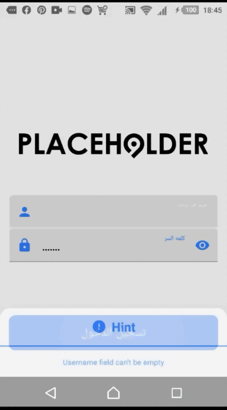

# HalanChallenge

## ScreenShot

  

## Built With 🛠
- [Kotlin](https://kotlinlang.org/) - First class and official programming language for Android development.
- [Coroutines](https://kotlinlang.org/docs/reference/coroutines-overview.html) - For asynchronous and more..
- [Flow](https://kotlin.github.io/kotlinx.coroutines/kotlinx-coroutines-core/kotlinx.coroutines.flow/-flow/) - A cold asynchronous data stream that sequentially emits values and completes normally or with an exception.
- [Android Architecture Components](https://developer.android.com/topic/libraries/architecture) - Collection of libraries that help you design robust, testable, and maintainable apps.
  - [LiveData](https://developer.android.com/topic/libraries/architecture/livedata) - Data objects that notify views when the underlying database changes.
  - [ViewModel](https://developer.android.com/topic/libraries/architecture/viewmodel) - Stores UI-related data that isn't destroyed on UI changes. 
  - [ViewBinding](https://developer.android.com/topic/libraries/view-binding) - Generates a binding class for each XML layout file present in that module and allows you to more easily write code that interacts with views.
- [Dependency Injection](https://developer.android.com/training/dependency-injection) - 
  - [`Koin`](https://insert-koin.io/) DI Version 🗡️
- [Retrofit](https://square.github.io/retrofit/) - A type-safe HTTP client for Android and Java.
- [Moshi](https://github.com/square/moshi) - A modern JSON library for Kotlin and Java.
- [Moshi Converter](https://github.com/square/retrofit/tree/master/retrofit-converters/moshi) - A Converter which uses Moshi for serialization to and from JSON.
- [Picasso](https://square.github.io/picasso/) - An image loading library for Android backed by Kotlin Coroutines.
- [Material Components for Android](https://github.com/material-components/material-components-android) - Modular and customizable Material Design UI components for Android.
- [Gradle Kotlin DSL](https://docs.gradle.org/current/userguide/kotlin_dsl.html) - For writing Gradle build scripts using Kotlin.

**Contributed By:** [islam elhady](https://github.com/islamelhady)

# Package Structure
    
    com.example.halanchallenge  # Root Package
    .
    ├── data                    # For data handling.
    │   ├── model               # Model classes.
    |   ├── remote              # Remote Data Handlers.  
    |   │   └── api             # Retrofit API for remote end point.
    │   └── repository          # Single source of data.
    |      
    ├── di                      # Dependency Injection             
    │   ├── builder             # Activity Builder
    │   ├── component           # DI Components       
    │   └── module              # DI Modules
    |
    ├── ui                      # Activity/View layer
    │   ├── adapters            # Base Adapters Package
    |   │   ├  ProductsAdapter  # Main adapter with ViewHolder for Products Items
    |   │   └─ SliderAdapter    # adapter with ViewHodler for sliders Images
    │   ├── view                # ui
    │   │   ├── login           # Login Screen Activity & ViewModel
    |   │   │   ├──Fragment     # Fragment
    |   │   │   └── viewmodel   # ViewModel for Main Fragmnet
    │   │   ├── details         # Detail Screen Fragment and ViewModel
    |   │   │   ├─ Fragment     # Fragment
    │   │   ├── list            # List Screen Fragment and ViewModel
    |   │   │   ├─ Fragment     # Fragment
    |   │   │   └─ viewmodel    # ViewModel for Details Fragmnet 
    │   │   ├── bottomDialog    # Dialog Screen Fragment to handel login error
    |   │   │   └─ Fragment     # Fragment
    |   
    └── utils                   # Utility Classes / Kotlin extensions
    
    
    
    

## Architecture
This app uses [***MVVM (Model View View-Model)***](https://developer.android.com/jetpack/docs/guide#recommended-app-arch) architecture.

